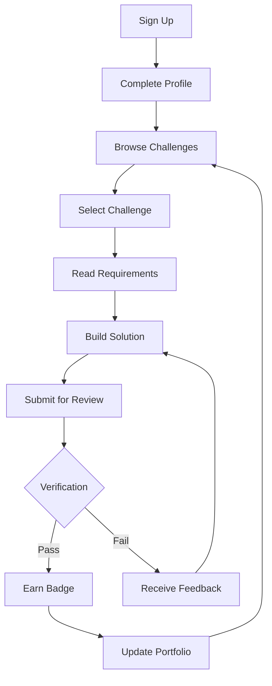
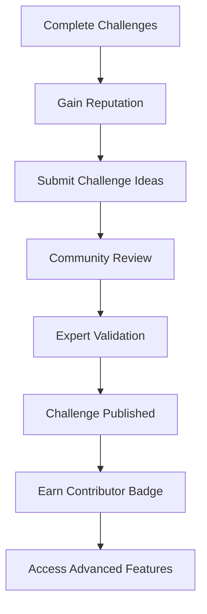

# Workflow Automation Challenge Platform - Development Plan

## Table of Contents
1. [Platform Overview & Vision](#platform-overview--vision)
2. [Technology Stack & Architecture](#technology-stack--architecture)
3. [Core Features](#core-features)
4. [User Journey & Experience](#user-journey--experience)
5. [Challenge Creation Framework](#challenge-creation-framework)
6. [Self-Hosting & Deployment](#self-hosting--deployment)
7. [Community Features](#community-features)
8. [Monetization & Sustainability](#monetization--sustainability)
9. [Development Phases](#development-phases)
10. [Success Metrics](#success-metrics)

---

## Platform Overview & Vision

### Mission Statement
Create a bridge between automation tool tutorials and real-world business problem solving by providing verifiable, portfolio-building practice environments.

### Core Objectives
- **Educational Bridge**: Connect theoretical learning with practical application
- **Portfolio Building**: Enable users to showcase verifiable automation skills
- **Community Driven**: Foster collaboration and knowledge sharing
- **Accessibility**: Free, self-hostable, and open-source friendly
- **Industry Relevance**: Focus on real-world business scenarios

### Target Audience
- **Primary**: Automation enthusiasts learning n8n, Zapier, Make.com
- **Secondary**: Freelancers and consultants building portfolios
- **Tertiary**: Students and professionals transitioning to automation roles
- **Enterprise**: Teams looking to upskill in workflow automation

---

## Technology Stack & Architecture

### Frontend Architecture
```
React/Next.js Application
├── UI Components (Tailwind CSS)
├── State Management (Zustand/Redux Toolkit)
├── Real-time Updates (WebSocket/Socket.io)
├── Progressive Web App (PWA)
└── Mobile Responsive Design
```

**Frontend Technologies:**
- **Framework**: Next.js 14+ with App Router
- **Styling**: Tailwind CSS + Headless UI
- **State Management**: Zustand for global state
- **Real-time**: Socket.io client
- **Charts/Analytics**: Chart.js or Recharts
- **Code Editor**: Monaco Editor (VS Code editor)
- **Testing**: Jest + React Testing Library

### Backend Architecture
```
Microservices Architecture
├── API Gateway (Express.js/FastAPI)
├── Authentication Service (JWT + OAuth)
├── Challenge Management Service
├── Verification Engine
├── Portfolio Service
├── Community Features Service
└── Analytics Service
```

**Backend Technologies:**
- **Runtime**: Node.js 18+ or Python 3.11+
- **Framework**: Express.js or FastAPI
- **Database**: PostgreSQL 15+ (primary), Redis (cache)
- **Authentication**: JWT + Passport.js or Auth0
- **File Storage**: MinIO (S3-compatible) or AWS S3
- **Message Queue**: Redis Bull or Celery
- **Testing**: Jest/Pytest + Supertest

### Infrastructure & DevOps
```
Containerized Deployment
├── Docker Compose (Development)
├── Kubernetes (Production)
├── CI/CD Pipeline (GitHub Actions)
├── Monitoring (Prometheus + Grafana)
└── Logging (ELK Stack)
```

**Infrastructure Stack:**
- **Containerization**: Docker + Docker Compose
- **Orchestration**: Kubernetes (optional)
- **CI/CD**: GitHub Actions
- **Monitoring**: Prometheus + Grafana + AlertManager
- **Logging**: ELK Stack (Elasticsearch, Logstash, Kibana)
- **Reverse Proxy**: Nginx
- **SSL**: Let's Encrypt

---

## Core Features

### 1. Challenge Management System

#### Challenge Categories
- **Data Processing**: ETL workflows, data validation, transformation
- **Integration**: API connections, webhook handling, system synchronization
- **Decision Making**: Business logic implementation, conditional workflows
- **Error Handling**: Robust error management, retry mechanisms
- **Scalability**: High-volume processing, performance optimization

#### Challenge Difficulty Levels
- **Beginner**: Basic workflows, simple integrations
- **Intermediate**: Multi-step processes, error handling
- **Advanced**: Complex business logic, performance optimization
- **Expert**: Enterprise-level scenarios, custom integrations

#### Challenge Metadata
```json
{
  "id": "challenge_001",
  "title": "E-commerce Order Processing Automation",
  "description": "Create a workflow to process orders from multiple channels",
  "difficulty": "intermediate",
  "category": "integration",
  "estimatedTime": "2-4 hours",
  "prerequisites": ["n8n_basics", "api_integration"],
  "tags": ["ecommerce", "orders", "inventory"],
  "businessContext": "Real-world scenario from online retailer",
  "successCriteria": {
    "functional": ["Process 100% of valid orders", "Handle 3 error types"],
    "performance": ["Complete within 30 seconds", "99% success rate"],
    "documentation": ["Explain workflow logic", "Document error handling"]
  }
}
```

### 2. Verification Framework

#### Automated Testing
- **Unit Tests**: Individual workflow node testing
- **Integration Tests**: End-to-end workflow validation
- **Performance Tests**: Speed and resource usage benchmarks
- **Error Simulation**: Test error handling capabilities

#### Manual Review Process
- **Peer Review**: Community-driven solution validation
- **Expert Review**: Industry professional assessment
- **Code Quality**: Best practices and maintainability scoring
- **Documentation Review**: Clarity and completeness evaluation

#### Verification Criteria
```yaml
verification_criteria:
  functional:
    - workflow_executes_successfully: true
    - handles_all_test_cases: true
    - produces_expected_outputs: true
  performance:
    - execution_time_under_limit: true
    - memory_usage_acceptable: true
    - error_rate_below_threshold: true
  quality:
    - follows_best_practices: true
    - includes_error_handling: true
    - well_documented: true
```

### 3. Portfolio Building System

#### User Profile Features
- **Public Profile**: Showcase completed challenges
- **Skill Badges**: Earned certifications for competencies
- **Project Showcases**: Detailed case studies
- **Social Proof**: Community endorsements and ratings
- **Resume Integration**: Export portfolio data

#### Portfolio Components
- **Challenge Completions**: Verified solutions with metrics
- **Skill Assessments**: Automated skill level evaluation
- **Project Gallery**: Visual showcase of workflows
- **Testimonials**: Peer and mentor recommendations
- **Achievement Timeline**: Progress tracking over time

---

## User Journey & Experience

### Learner Journey


### Contributor Journey


### User Roles & Permissions
- **Learner**: Access challenges, build portfolio, participate in community
- **Contributor**: Submit challenges, review solutions, mentor others
- **Expert**: Validate challenges, provide advanced feedback, access analytics
- **Admin**: Platform management, user moderation, content curation

---

## Challenge Creation Framework

### Challenge Development Process

#### 1. Scenario Collection
- **Industry Research**: Identify common automation needs
- **Community Input**: User-submitted scenarios
- **Expert Consultation**: Industry professional insights
- **Case Study Analysis**: Real-world automation examples

#### 2. Challenge Design
- **Requirements Definition**: Clear, measurable objectives
- **Test Case Creation**: Comprehensive validation scenarios
- **Difficulty Assessment**: Appropriate skill level placement
- **Resource Planning**: Required tools and data sets

#### 3. Validation Framework
- **Automated Testing**: Unit and integration test suites
- **Performance Benchmarks**: Speed and efficiency metrics
- **Quality Standards**: Code review criteria
- **Documentation Requirements**: Solution explanation standards

### Challenge Templates

#### Data Processing Template
```yaml
template: data_processing
structure:
  - input_data: "Sample dataset with known issues"
  - processing_steps: "Required transformations"
  - validation_rules: "Data quality checks"
  - output_format: "Expected result structure"
  - error_scenarios: "Common failure cases"
```

#### Integration Template
```yaml
template: integration
structure:
  - source_systems: "APIs or data sources"
  - authentication: "Required credentials"
  - data_mapping: "Field transformations"
  - error_handling: "Failure scenarios"
  - monitoring: "Success/failure tracking"
```

---

## Self-Hosting & Deployment

### Docker Compose Setup

#### Development Environment
```yaml
version: '3.8'
services:
  frontend:
    build: ./frontend
    ports:
      - "3000:3000"
    environment:
      - NODE_ENV=development
    volumes:
      - ./frontend:/app
      - /app/node_modules

  backend:
    build: ./backend
    ports:
      - "8000:8000"
    environment:
      - DATABASE_URL=postgresql://user:pass@db:5432/platform
      - REDIS_URL=redis://redis:6379
    depends_on:
      - db
      - redis

  db:
    image: postgres:15
    environment:
      - POSTGRES_DB=platform
      - POSTGRES_USER=user
      - POSTGRES_PASSWORD=pass
    volumes:
      - postgres_data:/var/lib/postgresql/data

  redis:
    image: redis:7-alpine
    volumes:
      - redis_data:/data

volumes:
  postgres_data:
  redis_data:
```

#### Production Deployment
```yaml
version: '3.8'
services:
  frontend:
    image: platform-frontend:latest
    ports:
      - "80:80"
      - "443:443"
    environment:
      - NODE_ENV=production
    volumes:
      - ./ssl:/etc/ssl/certs

  backend:
    image: platform-backend:latest
    environment:
      - DATABASE_URL=${DATABASE_URL}
      - REDIS_URL=${REDIS_URL}
      - JWT_SECRET=${JWT_SECRET}
    depends_on:
      - db
      - redis

  db:
    image: postgres:15
    environment:
      - POSTGRES_DB=${DB_NAME}
      - POSTGRES_USER=${DB_USER}
      - POSTGRES_PASSWORD=${DB_PASSWORD}
    volumes:
      - postgres_data:/var/lib/postgresql/data
      - ./backups:/backups

  redis:
    image: redis:7-alpine
    volumes:
      - redis_data:/data

  nginx:
    image: nginx:alpine
    ports:
      - "80:80"
      - "443:443"
    volumes:
      - ./nginx.conf:/etc/nginx/nginx.conf
      - ./ssl:/etc/ssl/certs
```

### Deployment Options

#### 1. Local Development
```bash
# Clone repository
git clone https://github.com/your-org/workflow-platform.git
cd workflow-platform

# Start development environment
docker-compose -f docker-compose.dev.yml up -d

# Access application
open http://localhost:3000
```

#### 2. VPS Deployment
```bash
# One-click deployment script
curl -fsSL https://raw.githubusercontent.com/your-org/workflow-platform/main/scripts/deploy.sh | bash

# Manual deployment
git clone https://github.com/your-org/workflow-platform.git
cd workflow-platform
docker-compose up -d
```

#### 3. Cloud Platform Deployment
- **Railway**: One-click deployment with GitHub integration
- **DigitalOcean App Platform**: Managed container deployment
- **AWS ECS**: Enterprise-grade container orchestration
- **Google Cloud Run**: Serverless container deployment

### Backup & Recovery
```bash
# Database backup
docker exec platform_db pg_dump -U user platform > backup_$(date +%Y%m%d).sql

# Full system backup
tar -czf platform_backup_$(date +%Y%m%d).tar.gz \
  --exclude=node_modules \
  --exclude=.git \
  .
```

---

## Community Features

### Collaboration Tools

#### Discussion Forums
- **Challenge-specific Q&A**: Dedicated discussion threads
- **Solution Sharing**: Public solution repository
- **Best Practices**: Community-driven guidelines
- **Troubleshooting**: Peer support system

#### Mentorship Program
- **Mentor Matching**: Connect experienced users with learners
- **Progress Tracking**: Monitor mentee development
- **Achievement Recognition**: Reward mentorship contributions
- **Skill Assessment**: Mentor-validated skill verification

#### Team Challenges
- **Collaborative Projects**: Multi-person workflow development
- **Team Leaderboards**: Group performance rankings
- **Project Management**: Task assignment and tracking
- **Code Review**: Team-based solution validation

### Gamification Elements

#### Achievement System
```yaml
achievements:
  first_challenge:
    name: "Getting Started"
    description: "Complete your first challenge"
    icon: "🎯"
    points: 10
  
  speed_demon:
    name: "Speed Demon"
    description: "Complete 5 challenges in under estimated time"
    icon: "⚡"
    points: 50
  
  mentor:
    name: "Mentor"
    description: "Successfully mentor 3 users"
    icon: "👨‍🏫"
    points: 100
  
  expert_reviewer:
    name: "Expert Reviewer"
    description: "Provide 20 expert-level reviews"
    icon: "🔍"
    points: 200
```

#### Leaderboards
- **Weekly Top Performers**: Challenge completion leaders
- **Skill-specific Rankings**: Category-based performance
- **Community Contributors**: Most helpful members
- **Mentorship Leaders**: Top mentors by impact

#### Streaks & Challenges
- **Daily Challenge Streaks**: Consistent participation rewards
- **Monthly Competitions**: Special themed challenges
- **Seasonal Events**: Limited-time exclusive content
- **Community Goals**: Collaborative achievement targets

---

## Monetization & Sustainability

### Free Tier Features
- **Core Challenges**: Access to basic and intermediate challenges
- **Community Features**: Forums, discussions, peer review
- **Portfolio Building**: Public profile and project showcase
- **Self-hosting**: Complete platform deployment capability
- **Open Source**: Full source code access and contribution

### Premium Features (Optional)
- **Advanced Challenges**: Expert-level scenarios and enterprise cases
- **Priority Support**: Faster response times and dedicated help
- **Custom Challenge Creation**: Advanced tools for challenge development
- **Analytics Dashboard**: Detailed performance insights
- **API Access**: Programmatic access to platform features
- **White-label Options**: Custom branding for enterprise deployments

### Revenue Streams

#### 1. Corporate Training Partnerships
- **Enterprise Licenses**: Custom deployment for large organizations
- **Training Programs**: Structured learning paths for teams
- **Certification Programs**: Industry-recognized credentials
- **Consulting Services**: Implementation and optimization support

#### 2. Marketplace & Ecosystem
- **Challenge Marketplace**: Premium challenges from industry experts
- **Tool Integrations**: Partnerships with automation tool providers
- **Third-party Extensions**: Community-developed plugins
- **API Monetization**: Usage-based pricing for API access

#### 3. Community Support
- **Donations**: Open-source project funding
- **Sponsorships**: Corporate sponsorship opportunities
- **Crowdfunding**: Feature development campaigns
- **Grants**: Educational and research funding

### Sustainability Model
```yaml
sustainability_strategy:
  open_source_core:
    - "Core platform remains free and open-source"
    - "Community-driven development and maintenance"
    - "Transparent development process"
  
  premium_services:
    - "Advanced features for power users"
    - "Enterprise-grade support and customization"
    - "Professional development and certification"
  
  community_funding:
    - "Donation-based support for core development"
    - "Corporate sponsorships for specific features"
    - "Crowdfunding for major platform improvements"
```

---

## Development Phases

### Phase 1: MVP Foundation (Months 1-3) - Focused Learning & Portfolio Platform

#### 1. Tool Selection & Focused Experience

**Tool Selection Interface:**
- **Primary Tools**: Zapier, N8N, Make.com, Microsoft Power Automate, IFTTT
- **Tool Profiles**: Each tool gets its own focused experience
- **Skill Assessment**: Initial quiz to determine user's current level
- **Personalized Onboarding**: Customized experience based on selected tool

**Focused Dashboard Features:**
```yaml
tool_focused_dashboard:
  zapier:
    - "Zapier-specific tutorials and challenges"
    - "Zapier workflow templates and examples"
    - "Zapier community discussions"
    - "Zapier skill progression tracking"
  
  n8n:
    - "N8N-specific tutorials and challenges"
    - "N8N workflow templates and examples"
    - "N8N community discussions"
    - "N8N skill progression tracking"
  
  make:
    - "Make.com-specific tutorials and challenges"
    - "Make.com workflow templates and examples"
    - "Make.com community discussions"
    - "Make.com skill progression tracking"
```

#### 2. Tutorial Feed & Dashboard System

**YouTube Integration:**
- **API Integration**: YouTube Data API v3 for tutorial discovery
- **Content Curation**: Manually curated high-quality tutorials
- **Difficulty Categorization**: Easy, Intermediate, Advanced, Expert
- **Search Capabilities**: Full-text search with filters
- **Progress Tracking**: Mark tutorials as watched, in-progress, or bookmarked

**Tutorial Feed Features:**
```yaml
tutorial_system:
  categorization:
    - difficulty_levels: ["Beginner", "Intermediate", "Advanced", "Expert"]
    - categories: ["Getting Started", "Integrations", "Advanced Workflows", "Troubleshooting"]
    - duration: ["Short (<10min)", "Medium (10-30min)", "Long (30min+)"]
  
  search_filters:
    - tool_specific: "Filter by selected automation tool"
    - difficulty: "Filter by difficulty level"
    - category: "Filter by tutorial category"
    - duration: "Filter by video length"
    - date: "Filter by upload date"
  
  personalization:
    - watched_history: "Track completed tutorials"
    - skill_level: "Recommend based on current level"
    - interests: "Recommend based on user preferences"
    - progress: "Show learning path progression"
```

**Dashboard Layout:**
- **Featured Tutorials**: Curated high-quality content
- **Continue Learning**: Resume where user left off
- **Recommended for You**: AI-powered suggestions
- **Trending**: Popular tutorials in the community
- **Recently Added**: Latest tutorial uploads

#### 3. Challenge Showcase System

**Challenge Display Features:**
- **All Challenges View**: Grid/list view of all user-created challenges
- **Challenge Metrics**: Completion count, average score, difficulty rating
- **User Submissions**: Optional display of automation outputs
- **Challenge Details**: Full description, requirements, and success criteria

**"Challenges for You" Recommendation Engine:**
```yaml
challenge_recommendations:
  based_on_tutorials:
    - "Challenges related to watched tutorials"
    - "Skills practiced in recent tutorials"
    - "Gap analysis between tutorials and challenges"
  
  based_on_competency:
    - "Current skill level assessment"
    - "Previous challenge performance"
    - "Tool-specific expertise level"
  
  real_world_problems:
    - "Business scenarios without specific instructions"
    - "Open-ended problem statements"
    - "Industry-specific challenges"
    - "General automation needs"
```

**Challenge Types:**
- **Business Scenarios**: "E-commerce order processing needs optimization"
- **Integration Challenges**: "Connect your CRM with your email marketing tool"
- **Data Processing**: "Your sales data needs cleaning and analysis"
- **Workflow Optimization**: "Your current process takes too long"

#### 4. Comprehensive Portfolio System

**Portfolio Components:**
```yaml
portfolio_sections:
  profile_overview:
    - "Professional photo and bio"
    - "Selected automation tool expertise"
    - "Skill level indicators"
    - "Contact information and social links"
  
  completed_challenges:
    - "Visual showcase of completed challenges"
    - "Challenge descriptions and solutions"
    - "Performance metrics and scores"
    - "Screenshots or videos of automations"
  
  tutorial_progress:
    - "Learning path completion"
    - "Skills acquired from tutorials"
    - "Certificates or badges earned"
    - "Time invested in learning"
  
  project_showcase:
    - "Real-world automation projects"
    - "Before/after comparisons"
    - "Business impact metrics"
    - "Client testimonials (if applicable)"
  
  skills_assessment:
    - "Self-rated skill levels"
    - "Community-verified skills"
    - "Tool-specific competencies"
    - "Industry knowledge areas"
```

**Portfolio Customization:**
- **Theme Selection**: Multiple professional themes
- **Layout Options**: Grid, list, or card-based layouts
- **Custom Sections**: Add custom sections for specific needs
- **Export Options**: PDF, web link, or embed code
- **Privacy Controls**: Public, private, or password-protected

### Phase 1: MVP Foundation (Months 1-3)

#### Core Features
- **Tool Selection System**: Choose automation tool (Zapier, N8N, Make, etc.) and focus experience
- **Tutorial Feed & Dashboard**: YouTube tutorial integration with difficulty categorization and search
- **Challenge Showcase**: Display user-created challenges with metrics and personalized recommendations
- **Comprehensive Portfolio**: Complete portfolio system for showcasing automation work
- **User Authentication**: Registration, login, and profile management

#### Technical Implementation Details

**Frontend Architecture (React/Next.js):**
```typescript
// Tool Selection Component
interface ToolSelection {
  id: string;
  name: string;
  description: string;
  icon: string;
  difficulty: 'beginner' | 'intermediate' | 'advanced';
  features: string[];
}

// Tutorial Feed Component
interface Tutorial {
  id: string;
  title: string;
  description: string;
  youtubeId: string;
  duration: number;
  difficulty: 'beginner' | 'intermediate' | 'advanced' | 'expert';
  category: string;
  tool: string;
  tags: string[];
  views: number;
  rating: number;
}

// Challenge Component
interface Challenge {
  id: string;
  title: string;
  description: string;
  difficulty: 'beginner' | 'intermediate' | 'advanced' | 'expert';
  tool: string;
  category: string;
  completionCount: number;
  averageScore: number;
  createdBy: string;
  createdAt: Date;
  tags: string[];
}
```

**Backend API Endpoints:**
```yaml
api_endpoints:
  user_management:
    - "POST /api/auth/register"
    - "POST /api/auth/login"
    - "GET /api/user/profile"
    - "PUT /api/user/profile"
    - "POST /api/user/tool-selection"
  
  tutorials:
    - "GET /api/tutorials?tool={tool}&difficulty={level}&search={query}"
    - "GET /api/tutorials/{id}"
    - "POST /api/tutorials/progress"
    - "GET /api/tutorials/recommended"
    - "GET /api/tutorials/trending"
  
  challenges:
    - "GET /api/challenges?tool={tool}&difficulty={level}"
    - "GET /api/challenges/{id}"
    - "GET /api/challenges/recommended"
    - "POST /api/challenges/submit"
    - "GET /api/challenges/user-submissions"
  
  portfolio:
    - "GET /api/portfolio/{userId}"
    - "PUT /api/portfolio/{userId}"
    - "POST /api/portfolio/project"
    - "DELETE /api/portfolio/project/{id}"
    - "GET /api/portfolio/export"
```

**Database Schema:**
```sql
-- Users table
CREATE TABLE users (
  id UUID PRIMARY KEY DEFAULT gen_random_uuid(),
  email VARCHAR(255) UNIQUE NOT NULL,
  username VARCHAR(100) UNIQUE NOT NULL,
  selected_tool VARCHAR(50),
  skill_level VARCHAR(20),
  created_at TIMESTAMP DEFAULT NOW(),
  updated_at TIMESTAMP DEFAULT NOW()
);

-- Tutorials table
CREATE TABLE tutorials (
  id UUID PRIMARY KEY DEFAULT gen_random_uuid(),
  youtube_id VARCHAR(20) UNIQUE NOT NULL,
  title VARCHAR(255) NOT NULL,
  description TEXT,
  duration INTEGER NOT NULL,
  difficulty VARCHAR(20) NOT NULL,
  category VARCHAR(100) NOT NULL,
  tool VARCHAR(50) NOT NULL,
  tags TEXT[],
  views INTEGER DEFAULT 0,
  rating DECIMAL(3,2) DEFAULT 0,
  created_at TIMESTAMP DEFAULT NOW()
);

-- Challenges table
CREATE TABLE challenges (
  id UUID PRIMARY KEY DEFAULT gen_random_uuid(),
  title VARCHAR(255) NOT NULL,
  description TEXT NOT NULL,
  difficulty VARCHAR(20) NOT NULL,
  tool VARCHAR(50) NOT NULL,
  category VARCHAR(100) NOT NULL,
  created_by UUID REFERENCES users(id),
  completion_count INTEGER DEFAULT 0,
  average_score DECIMAL(3,2) DEFAULT 0,
  tags TEXT[],
  created_at TIMESTAMP DEFAULT NOW()
);

-- User progress tracking
CREATE TABLE user_progress (
  id UUID PRIMARY KEY DEFAULT gen_random_uuid(),
  user_id UUID REFERENCES users(id),
  tutorial_id UUID REFERENCES tutorials(id),
  status VARCHAR(20) DEFAULT 'not_started',
  completed_at TIMESTAMP,
  created_at TIMESTAMP DEFAULT NOW()
);
```

**YouTube API Integration:**
```javascript
// YouTube API service
class YouTubeService {
  async searchTutorials(query, tool, difficulty) {
    const response = await fetch(
      `https://www.googleapis.com/youtube/v3/search?` +
      `part=snippet&q=${query}+${tool}+tutorial&` +
      `type=video&videoDuration=medium&` +
      `key=${process.env.YOUTUBE_API_KEY}`
    );
    return response.json();
  }

  async getVideoDetails(videoId) {
    const response = await fetch(
      `https://www.googleapis.com/youtube/v3/videos?` +
      `part=snippet,contentDetails&id=${videoId}&` +
      `key=${process.env.YOUTUBE_API_KEY}`
    );
    return response.json();
  }
}
```

#### Technical Deliverables
- [ ] Tool selection interface with focused dashboard experience
- [ ] YouTube API integration for tutorial feed and search
- [ ] Challenge display system with user metrics and recommendations
- [ ] Comprehensive portfolio builder with project showcase
- [ ] Frontend application with responsive design
- [ ] Backend API with user management and content curation
- [ ] Database schema for users, tools, tutorials, and challenges
- [ ] Docker Compose setup for easy deployment

#### Success Criteria
- 100+ registered users with tool preferences
- 500+ categorized YouTube tutorials across all tools
- 50+ user-created challenges with engagement metrics
- 80% of users create comprehensive portfolios
- 95% uptime for self-hosted deployments

### Phase 2: Community & Enhancement (Months 4-6)

#### Advanced Features
- **Community Features**: Forums, discussions, peer review
- **Advanced Challenge Types**: Complex scenarios and validation
- **Mentorship System**: Mentor-mentee matching and tracking
- **Mobile Responsiveness**: PWA capabilities and mobile optimization
- **Analytics Dashboard**: User progress and platform metrics

#### Technical Deliverables
- [ ] Real-time communication system (WebSockets)
- [ ] Advanced verification engine with performance testing
- [ ] Community features and social interaction tools
- [ ] Mobile-responsive design and PWA implementation
- [ ] Analytics and reporting system
- [ ] Enhanced self-hosting with production configurations

#### Success Criteria
- 500+ registered users
- 100+ published challenges
- 200+ completed submissions
- Active community with 50+ daily discussions

### Phase 3: Scale & Enterprise (Months 7-12)

#### Enterprise Features
- **Advanced Analytics**: Detailed performance insights and reporting
- **API Ecosystem**: Comprehensive API for third-party integrations
- **Enterprise Deployment**: Kubernetes and cloud-native options
- **Marketplace**: Challenge marketplace and third-party content
- **Certification Programs**: Industry-recognized skill validation

#### Technical Deliverables
- [ ] Comprehensive API with rate limiting and authentication
- [ ] Kubernetes deployment configurations
- [ ] Advanced analytics and business intelligence features
- [ ] Marketplace system for challenge distribution
- [ ] Certification and credentialing system
- [ ] Enterprise-grade security and compliance features

#### Success Criteria
- 2,000+ registered users
- 500+ published challenges
- 1,000+ completed submissions
- 10+ enterprise customers
- 95% user satisfaction rating

---

## Success Metrics

### User Engagement Metrics
```yaml
engagement_metrics:
  user_acquisition:
    - monthly_active_users: "Target: 2,000+ by month 12"
    - user_registration_rate: "Target: 20% month-over-month growth"
    - user_retention_rate: "Target: 70% monthly retention"
  
  platform_usage:
    - challenge_completion_rate: "Target: 60% of started challenges"
    - average_session_duration: "Target: 45+ minutes"
    - daily_active_users: "Target: 200+ by month 6"
  
  community_participation:
    - forum_posts_per_day: "Target: 50+ posts"
    - peer_reviews_per_week: "Target: 100+ reviews"
    - mentorship_matches: "Target: 50+ active pairs"
```

### Quality Indicators
```yaml
quality_metrics:
  solution_accuracy:
    - verification_pass_rate: "Target: 85%+ first-time pass rate"
    - solution_quality_score: "Target: 4.0+ average rating"
    - expert_validation_rate: "Target: 90%+ expert approval"
  
  platform_performance:
    - uptime_percentage: "Target: 99.5%+ uptime"
    - response_time: "Target: <2 seconds average"
    - error_rate: "Target: <1% error rate"
  
  user_satisfaction:
    - net_promoter_score: "Target: 50+ NPS"
    - user_satisfaction_rating: "Target: 4.5+ stars"
    - support_ticket_resolution: "Target: <24 hours"
```

### Business Impact Metrics
```yaml
business_metrics:
  portfolio_building:
    - portfolio_creation_rate: "Target: 80% of users create portfolio"
    - job_placement_rate: "Target: 30% of users report job success"
    - skill_improvement: "Target: 90% report skill advancement"
  
  community_growth:
    - contributor_growth: "Target: 100+ active contributors"
    - challenge_submission_rate: "Target: 20+ new challenges/month"
    - content_quality: "Target: 4.0+ average challenge rating"
  
  platform_adoption:
    - self_hosting_adoption: "Target: 50+ self-hosted instances"
    - enterprise_adoption: "Target: 10+ enterprise customers"
    - api_usage: "Target: 1M+ API calls/month"
```

---

## Conclusion

This comprehensive plan provides a roadmap for building a successful workflow automation challenge platform that bridges the gap between learning and real-world application. The platform's focus on verifiable portfolio building, community-driven development, and self-hosting capabilities ensures it remains accessible while providing genuine value to users.

Key success factors:
- **Community-driven development** ensures relevance and sustainability
- **Self-hosting capabilities** maintain accessibility and control
- **Verification framework** provides genuine skill validation
- **Portfolio building** creates tangible career value
- **Open-source approach** fosters innovation and adoption

The phased development approach allows for iterative improvement while maintaining focus on core value delivery. Success metrics provide clear targets for measuring progress and ensuring the platform meets user needs effectively.
